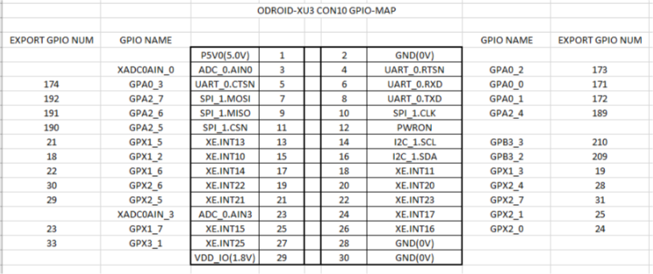

# ODROID GPIO

## Description
Basic library to control the GPIO ports ODROID-XU3 platform. 
This repository contains a library for C and other one for python. 
It also contains examples of use.

## To Install
Copy files on src folders in your project path

## To Use
Import libraries in your project. You can see examples on test folder.

## GPIO map
